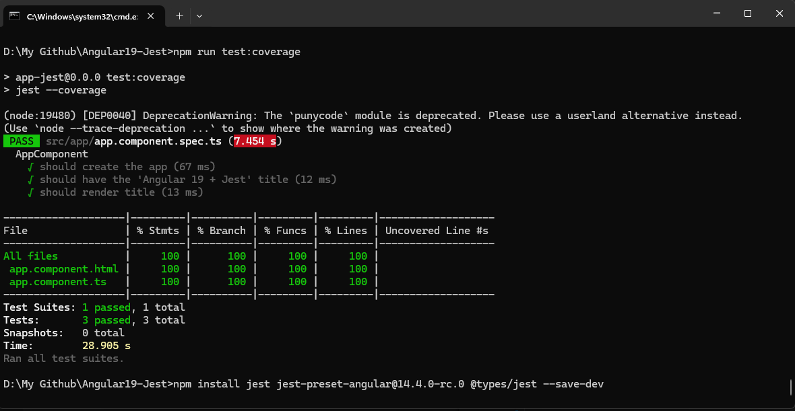

<!-- # Angular 19 + Jest Boilerplate 

This project was generated using [Angular CLI](https://github.com/angular/angular-cli) version 19.0.6.
A clean and minimal boilerplate for building Angular 19 applications with Jest as the testing framework — no Karma, no Jasmine.

---

## 🚀 Features

- ✅ Angular 19
- ✅ Jest for unit testing
- ✅ Pre-configured `jest.config.js` and `setup-jest.ts`
- ✅ Support for:
  - Standalone components
  - External templates and styles
  - DOM and service testing
- ✅ Fast test runs with watch mode
- ✅ Code coverage support

---

## 📦 Getting Started

### A. Clone the Repo and test

```bash
git clone https://github.com/alimori/Angular19-Jest.git

cd Angular19-Jest

npm i

npm run test
```

### B. Generate new Angular 19 app and add jest

1) Remove Karma & Jasmin:

    ```bash
    npm uninstall @types/jasmine jasmine-core karma karma-chrome-launcher karma-coverage karma-jasmine karma-jasmine-html-reporter
    ```

2) Add jest (Install the jest dependencies)"
    ```bash
    npm install jest jest-preset-angular@14.4.0-rc.0 @types/jest --save-dev
    ```
    **Note:** The *jest-preset-angular* has peer dependency confilict with angulr 19, so use exactly this version *jest-preset-angular@14.4.0-rc.0.*

3) Update test script on package.json file:
    ```bash
    "scripts": {
        ...
        "test": "jest",
        "test:watch": "jest --watch",
        "test:coverage": "jest --coverage",
    ```

4) Create jest.config.js file:
    ```bash
    module.exports = {
        preset: 'jest-preset-angular',
        setupFilesAfterEnv: ['<rootDir>/setup-jest.ts'],
        testPathIgnorePatterns: ['<rootDir>/node_modules/', '<rootDir>/dist/'],
        transform: {
        '^.+\\.ts$': 'ts-jest', // Only transform .ts files
        },
        transformIgnorePatterns: [
            '/node_modules/(?!flat)/', // Exclude modules except 'flat' from transformation
        ],
    };
    ```

5) Create setup-jest.ts file:
    ```bash
    import { setupZoneTestEnv } from 'jest-preset-angular/setup-env/zone';
    setupZoneTestEnv();
    ```
    
6) Update tsconfig.spec.json file:
    ```bash
    {
    "extends": "./tsconfig.json",
    "compilerOptions": {
        "outDir": "./out-tsc/spec",
        "types": ["jest", "node"]
    },
    "include": [
        "src/**/*.spec.ts",
        "src/**/*.d.ts"
    ]
    }
    ```

7) Update the test property in angular.json file:
    ```bash
    "test": {
        "builder": "@angular-devkit/build-angular:jest",
        "options": {
            "tsConfig": "tsconfig.spec.json"
        }
    }
    ```

8) Verify that esModuleInterop property is included in tsconfig.json file:
    ```bash
    "compilerOptions": {
        ...
        "esModuleInterop": true, // <= add it if it is not there
    ``` -->

# Angular 19 + Jest Boilerplate

This project was generated using [Angular CLI](https://github.com/angular/angular-cli) version 19.0.6.  
It provides a clean and minimal setup for building Angular 19 applications with **Jest** — no Karma, no Jasmine.

---

## 🚀 Features

- ✅ Angular 19
- ✅ Jest for unit testing
- ✅ Pre-configured `jest.config.js` and `setup-jest.ts`
- ✅ Supports:
  - Standalone components
  - External templates and styles
  - DOM and service testing
- ✅ Fast test runs with watch mode
- ✅ Code coverage support

---

## 📦 Getting Started

### A. Clone the Repo and Run Tests

```bash
git clone https://github.com/alimori/Angular19-Jest.git
cd Angular19-Jest

npm install
npm run test
```

---

### B. Setup Jest in a Fresh Angular 19 App

If you'd like to add Jest manually to a new Angular 19 app, follow these steps:

---

#### 1️⃣ Remove Karma & Jasmine

```bash
npm uninstall @types/jasmine jasmine-core karma karma-chrome-launcher karma-coverage karma-jasmine karma-jasmine-html-reporter
```

---

#### 2️⃣ Install Jest Dependencies

```bash
npm install jest jest-preset-angular@14.4.0-rc.0 @types/jest --save-dev
```

> ⚠️ **Note:** `jest-preset-angular` has peer dependency conflicts with Angular 19, so make sure to use exactly version `14.4.0-rc.0`.

---

#### 3️⃣ Update `package.json` Scripts

```json
"scripts": {
  ...
  "test": "jest",
  "test:watch": "jest --watch",
  "test:coverage": "jest --coverage"
}
```

---

#### 4️⃣ Create `jest.config.js`

```js
module.exports = {
  preset: 'jest-preset-angular',
  setupFilesAfterEnv: ['<rootDir>/setup-jest.ts'],
  testPathIgnorePatterns: ['<rootDir>/node_modules/', '<rootDir>/dist/'],
  transform: {
    '^.+\\.ts$': 'ts-jest',
  },
  transformIgnorePatterns: [
    '/node_modules/(?!flat)/',
  ],
};
```

---

#### 5️⃣ Create `setup-jest.ts`

```ts
import { setupZoneTestEnv } from 'jest-preset-angular/setup-env/zone';
setupZoneTestEnv();
```

---

#### 6️⃣ Update `tsconfig.spec.json`

```json
{
  "extends": "./tsconfig.json",
  "compilerOptions": {
    "outDir": "./out-tsc/spec",
    "types": ["jest", "node"]
  },
  "include": [
    "src/**/*.spec.ts",
    "src/**/*.d.ts"
  ]
}
```

---

#### 7️⃣ Update `angular.json` (Optional if not using CLI to run tests)

```json
"test": {
  "builder": "@angular-devkit/build-angular:jest",
  "options": {
    "tsConfig": "tsconfig.spec.json"
  }
}
```

---

#### 8️⃣ Ensure `esModuleInterop` is Enabled in `tsconfig.json`

```json
"compilerOptions": {
  ...
  "esModuleInterop": true
}
```

---

## 🧪 Ready to Test!

Run your tests using:

```bash
npm run test
```

With coverage:

```bash
npm run test:coverage
```

Or in watch mode:

```bash
npm run test:watch
```




---
## 📄 License

MIT © [alimori](https://github.com/alimori)
